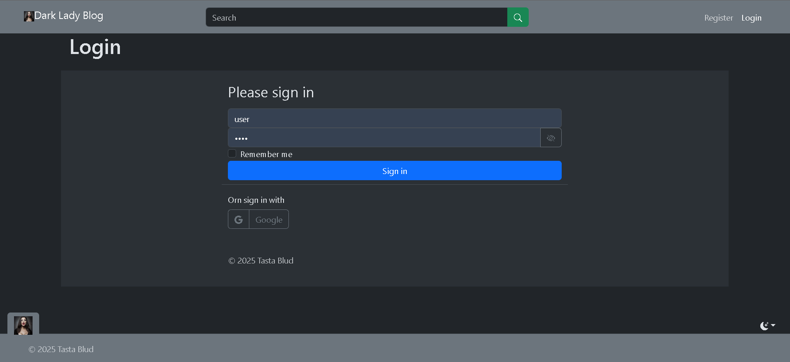

# Dark Lady Blog

A blog platform with ability to make multiple blogs by posting.

## Features

- Multiple users
- Multiple blogs per user
- Shortened content in lists
- Local registration or by sign-in platforms ([oauth](https://oauth.net/2/))
- In-place editing when registered
- Markdown visual editor
- Server maintenance tasks
- Real-time server notifications
- Chatbot helper (stub)
- Toast popup notifications
- Light theme and dark theme switching
- Topics pagination
- Ownership (creation and modification tracking)

## Technical details

- One language used for server-side, client-side, and CSS styling using DSL
- [Kotlin](https://kotlinlang.org/) [multiplatform](https://www.jetbrains.com/kotlin-multiplatform/): [Ktor](https://ktor.io/) [server](https://ktor.io/docs/server-create-a-new-project.html), [Koin](https://insert-koin.io/)
  Dependency Injection, [Fritz2](https://www.fritz2.dev/) frontend, [Exposed](https://www.jetbrains.com/exposed/) SQL
  library, [Bootstrap](https://getbootstrap.com/) CSS library, [i18n4k](https://comahe-de.github.io/i18n4k/) typesafe
  localization, [Editor.MD](https://pandao.github.io/editor.md/en.html)
  visual [Markdown](https://en.wikipedia.org/wiki/Markdown) editor, Kotlin multiplatform
  date-time [library](https://github.com/Kotlin/kotlinx-datetime)
- Multi-layer architecture (controllers, services, repositories(database related), entities and models (DTOs),
  interceptors)
- REST/JSON client-server communication as well as sockets
- [Websockets](https://developer.mozilla.org/en-US/docs/Web/API/WebSockets_API) communication for notifications and
  chatbot
- [Gradle](https://gradle.org/) build system
  and [version catalogs](https://docs.gradle.org/current/userguide/version_catalogs.html)
-
Kotlin [coroutines](https://kotlinlang.org/docs/coroutines-overview.html) [reactive](https://en.wikipedia.org/wiki/Reactive_programming) [flow](https://kotlinlang.org/docs/flow.html)
rendering
- [Hash](https://developer.mozilla.org/en-US/docs/Web/API/URL/hash)-based page routing
- Toast popup auto-hiding messages
- Markup is split into independent pages and reusable components
- Cross-platform logging ([slf4j](https://www.slf4j.org/) on server
  and [console](https://developer.mozilla.org/en-US/docs/Web/API/console/log_static))
- *.properties i18n files compiled

## Some screenshots:

Title:

Blogs:

Blog (with topics having shortened content):

Full single topic content:

Topic comments tab:

User info:

Registration (markdown visual editor):

Login:

Welcome message (toast) after login:

Message from server as toast:

My info editing:

User upper menu when logged in:

Theme switching:

Dialog with chatbot assistant:
